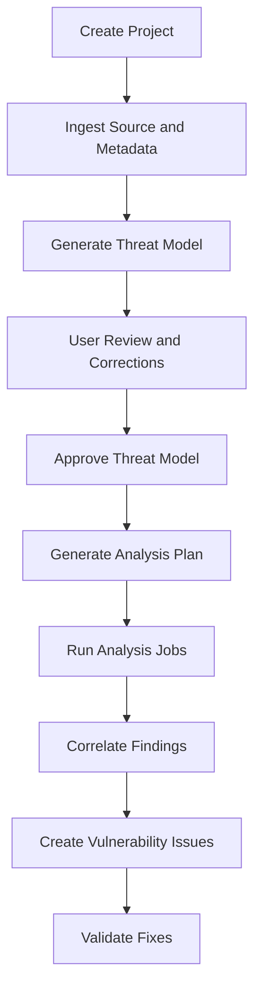
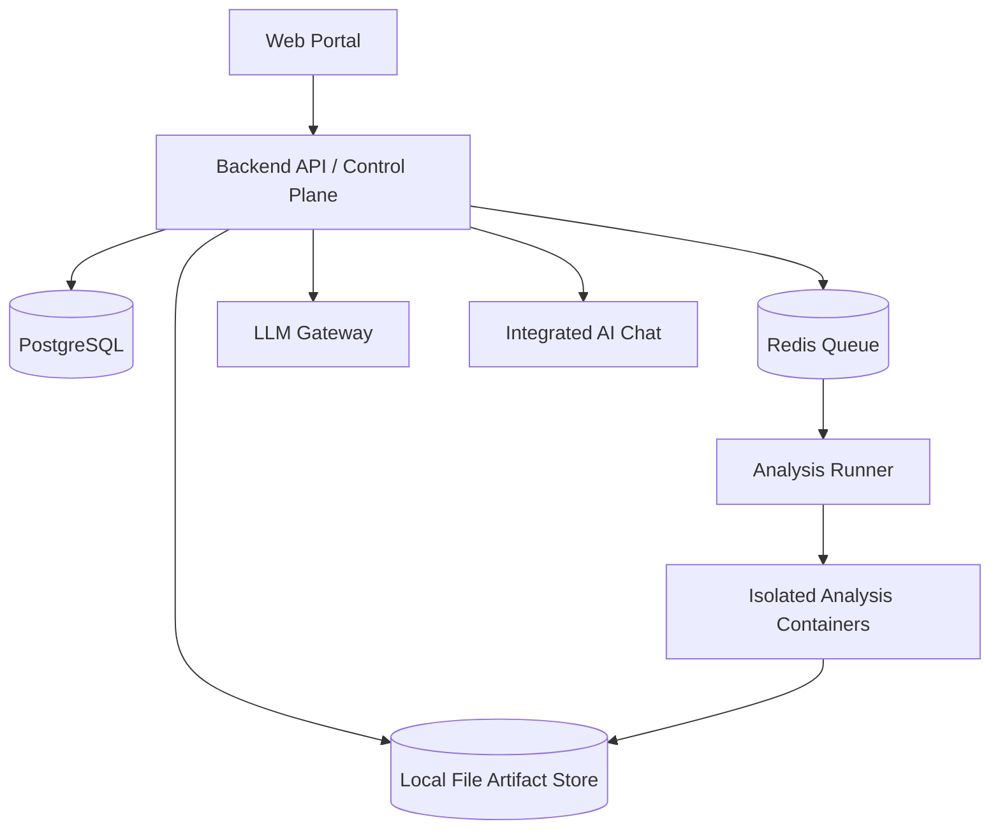

# Kavach360

Kavach360 is an AI-assisted cyber reasoning platform for understanding software architecture, generating threat models, finding real vulnerabilities, and validating fixes with evidence.

The platform is designed around a simple principle:

```text
Threat model first. Analyze second. Correlate evidence. Validate fixes.
```

Instead of behaving like a traditional scanner that produces a long list of raw alerts, Kavach360 first studies the source code and project metadata, creates a threat model, asks the user to verify assumptions, and then runs targeted analysis using static analysis, fuzzing, dependency checks, LLM reasoning, and fix validation workflows.

## What Kavach360 Does

- Creates projects from source repositories, uploaded archives, or mounted source paths.
- Infers architecture, components, data flows, entry points, trust boundaries, and sensitive assets.
- Generates AI-assisted threat models with diagrams for user review.
- Lets users correct AI assumptions through an integrated project chat.
- Converts the approved threat model into an analysis plan.
- Runs scanners, fuzzers, build checks, dependency checks, and skill-based reviews in isolated containers.
- Correlates raw tool outputs into real vulnerability issues.
- Creates rich issue tickets with impact, exploitability, evidence, flow diagrams, and suggested fixes.
- Validates proposed fixes by re-running reproducers, tests, static checks, and focused fuzzing.
- Supports pluggable LLM providers such as OpenAI, Claude, Gemini, local Ollama/vLLM, or OpenAI-compatible endpoints.

## Core Workflow



## Architecture

The reduced-scope architecture is Docker-based and keeps storage simple with a shared local artifact volume.



Main components:

- **Web Portal**: project setup, threat model review, runs, issues, fix validation, artifacts, model settings, and AI chat.
- **Backend API**: control plane for projects, jobs, threat models, issues, chat, and validation workflows.
- **PostgreSQL**: structured state such as projects, findings, issues, runs, revisions, and model configs.
- **Redis**: asynchronous job queue.
- **Local Artifact Store**: file-based storage for source snapshots, logs, reports, crashes, diagrams, patches, and validation evidence.
- **Analysis Runner**: launches controlled Docker containers for analysis jobs.
- **LLM Gateway**: provider-neutral interface for cloud and local LLMs.
- **Skills**: versioned, reproducible analysis recipes.

## Integrated AI Chat

Kavach360 includes a contextual AI chat available across project setup, threat model review, analysis runs, issue review, and fix validation.

The chat can help users:

- Correct wrong build or runtime assumptions.
- Inspect source files, logs, and artifacts.
- Debug failed build/test jobs inside disposable containers.
- Update project configuration after approval.
- Revise threat models and analysis plans.
- Explain findings and exploit flows.
- Propose patches.
- Start fix validation jobs.

State-changing AI actions should be reviewed before they are applied. User corrections should become structured platform state, not just conversation history.

## Documentation

- [Architecture](docs/architecture.md)
- [UI Layout](docs/ui-layout.md)

## Current Scope

The initial version focuses on a practical Docker Compose deployment:

- Web UI.
- Backend API.
- PostgreSQL.
- Redis queue.
- Local file-based artifact storage.
- Isolated Docker analysis jobs.
- Threat model generation and review.
- Analysis planning.
- Static analysis and fuzzing pipeline.
- Finding correlation.
- Issue creation.
- Fix validation.
- Integrated AI chat.
- LLM provider switching.
- Skill-based reproducibility.

Deferred for later versions:

- Keycloak/OIDC authentication.
- Multi-tenant RBAC.
- Kubernetes deployment.
- MinIO/S3 artifact storage.
- Distributed fuzzing.
- Enterprise audit/compliance reporting.

## Repository Status

This repository currently contains the product architecture and UI design documents. Implementation scaffolding will be added next.

Suggested next implementation milestones:

1. Create Docker Compose skeleton.
2. Add backend API service.
3. Add PostgreSQL schema and migrations.
4. Add web portal shell.
5. Add local artifact store.
6. Add queue and runner.
7. Add threat model workflow.
8. Add integrated AI chat and tool broker.

## License

License to be decided.

