# Kavach360 Architecture

## 1. Purpose

Kavach360 is a production-oriented cyber reasoning platform that helps users analyze source code, understand system risk, discover real vulnerabilities, and validate fixes.

The core product philosophy is:

```text
Understand first -> Analyze second -> Correlate evidence -> Create actionable issues -> Validate fixes
```

The platform should not behave like a basic scanner that immediately emits raw alerts. It should first build a threat model from the source code and project metadata, ask the user to verify that model, and only then run analysis jobs guided by that verified understanding.

## 2. Reduced-Scope Version

The first version deliberately avoids enterprise complexity while keeping the architecture production-minded.

Included in the reduced scope:

- Docker Compose deployment.
- Web portal for project setup, threat model review, analysis runs, issues, and validation.
- Backend API as the control plane.
- PostgreSQL for structured state.
- Redis for job queueing.
- Local file-based artifact storage.
- Isolated Docker analysis containers.
- Provider-neutral LLM gateway.
- Skill-based reproducible analysis workflows.
- Integrated AI chat with controlled access to project context and containers.

Delayed:

- Keycloak/OIDC authentication.
- Multi-tenant RBAC.
- Kubernetes orchestration.
- MinIO/S3 artifact storage.
- Distributed fuzzing cluster.
- Enterprise audit/compliance reporting.

Security isolation is not delayed. Even the reduced scope should avoid giving the web/API service unrestricted host or Docker access.

## 3. System Overview

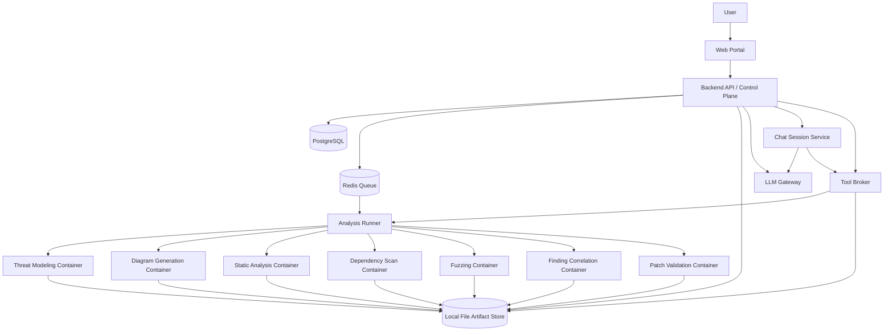

## 4. Core Components

### 4.1 Web Portal

The web portal is the user-facing control surface. It should support project creation, source configuration, threat model review, analysis run monitoring, issue review, fix validation, and integrated AI chat.

The portal should expose structured state, not only chat transcripts. When a user corrects an AI assumption, that correction should update the underlying project metadata, threat model, or analysis plan.

### 4.2 Backend API / Control Plane

The backend API owns platform state and orchestration.

Responsibilities:

- Create and update projects.
- Store project metadata.
- Manage source snapshots.
- Start and monitor asynchronous jobs.
- Store threat models and revisions.
- Store analysis plans and revisions.
- Normalize scanner and fuzzer outputs.
- Create and update vulnerability issues.
- Manage chat sessions and tool approvals.
- Route LLM requests through the LLM gateway.
- Store artifact references.

The backend should not directly perform heavy analysis. It should enqueue jobs and let isolated workers perform execution.

### 4.3 PostgreSQL

PostgreSQL stores structured, queryable state.

Primary data:

- Projects.
- Source configurations.
- Build profiles.
- Threat models.
- Threat model revisions.
- Analysis plans.
- Analysis runs.
- Job records.
- Raw findings.
- Correlated vulnerabilities.
- Issues/tickets.
- Patch proposals.
- Fix validation runs.
- Chat sessions.
- Chat messages.
- Tool calls and approvals.
- LLM provider configurations.
- Skill definitions and execution records.

PostgreSQL should not store large logs, archives, crash files, coverage files, or generated reports directly. It should store references to those files.

### 4.4 Redis Queue

Redis is used for asynchronous work scheduling.

Job examples:

- Generate threat model.
- Generate architecture diagrams.
- Generate analysis plan.
- Run static analysis.
- Run dependency scan.
- Run build/test.
- Run fuzzing.
- Triage crashes.
- Correlate findings.
- Create issues.
- Validate patch.

The first version can use Redis with a worker framework such as Celery, RQ, Dramatiq, or a lightweight custom queue. The important design rule is that long-running analysis jobs should not block HTTP requests.

### 4.5 Local File Artifact Store

For now, artifact storage is file-based.

Suggested layout:

```text
/artifacts
  /projects
    /{project_id}
      /sources
        /{snapshot_id}
      /threat-models
        /{threat_model_id}
      /runs
        /{run_id}
          /logs
          /reports
          /crashes
          /coverage
          /patches
          /validation
      /issues
        /{issue_id}
          /evidence
          /diagrams
          /patches
```

The application should access files through an `ArtifactStore` abstraction:

```text
ArtifactStore
  LocalFileArtifactStore
  S3ArtifactStore       # future
  MinIOArtifactStore    # future
```

This allows the reduced version to use Docker volumes while keeping a clean path to object storage later.

### 4.6 Analysis Runner

The runner consumes jobs from the queue and launches controlled analysis containers.

Responsibilities:

- Prepare a disposable workspace for each job.
- Mount the relevant source snapshot and artifact directory.
- Apply resource limits.
- Start the right analysis image.
- Stream logs to artifact storage.
- Capture structured outputs.
- Update job status.
- Clean up temporary containers/workspaces.

The runner is the only component in the reduced architecture that should need permission to launch Docker containers.

### 4.7 Analysis Containers

Each major job type should run in its own container image or controlled execution profile.

Examples:

- Threat modeling container.
- Diagram generation container.
- Static analysis container.
- Dependency scanning container.
- Build/test container.
- Fuzzing container.
- Crash triage container.
- LLM reasoning container.
- Finding correlation container.
- Patch validation container.

Containers should run as non-root where possible, with CPU/memory/time limits, limited filesystem mounts, and network access disabled unless explicitly required.

### 4.8 LLM Gateway

The LLM gateway provides a single interface for multiple providers.

Supported provider classes:

- OpenAI.
- Anthropic Claude.
- Google Gemini.
- Local Ollama.
- Local vLLM.
- OpenAI-compatible endpoints.

The gateway should support:

- Provider configuration.
- Model aliases.
- Structured JSON output.
- Prompt/version tracking.
- Retry policy.
- Timeout policy.
- Token/cost budgeting.
- Redaction rules.
- Request/response audit metadata.

The rest of the system should ask for a capability such as `reasoning-large`, `fast-json`, or `local-private` rather than hard-coding provider-specific model names everywhere.

### 4.9 Skills

Skills are reproducible analysis recipes. They package instructions, tools, expected inputs, expected outputs, and validation rules.

Example skill structure:

```text
skills/
  threat-model-web-api/
    skill.yaml
    instructions.md
    schema.input.json
    schema.output.json
    prompts/
    scripts/
    tests/
  patch-validation/
    skill.yaml
    instructions.md
    schema.input.json
    schema.output.json
    scripts/
```

A skill should define:

- Name and version.
- Purpose.
- Required tools.
- Container image.
- Input schema.
- Output schema.
- Prompt templates.
- Execution steps.
- Validation criteria.
- Reproducibility metadata.

Every skill run should record:

- Skill name and version.
- Container image digest.
- Source snapshot ID.
- Input artifact IDs.
- Output artifact IDs.
- LLM provider/model.
- Prompt version.
- Tool versions.
- Execution timestamp.
- Exit status.

## 5. Project Lifecycle

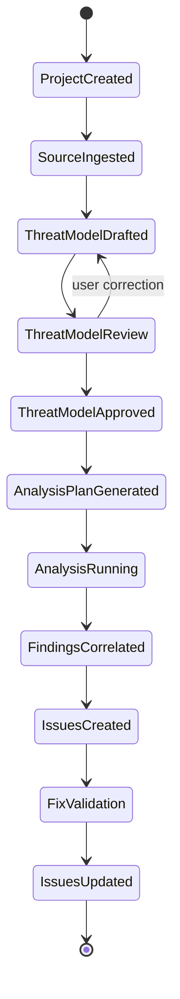

## 6. Threat Modeling Stage

Threat modeling is the first major AI stage.

Inputs:

- Source code snapshot.
- Project metadata.
- Build profile.
- Runtime/deployment assumptions.
- User-provided details.
- Dependency manifests.
- Existing documentation.

Outputs:

- System overview.
- Components.
- Data flows.
- Trust boundaries.
- Actors.
- Entry points.
- Sensitive assets.
- External services.
- Security assumptions.
- Risk areas.
- Suggested analysis plan.
- Architecture diagrams.

Threat model flow:

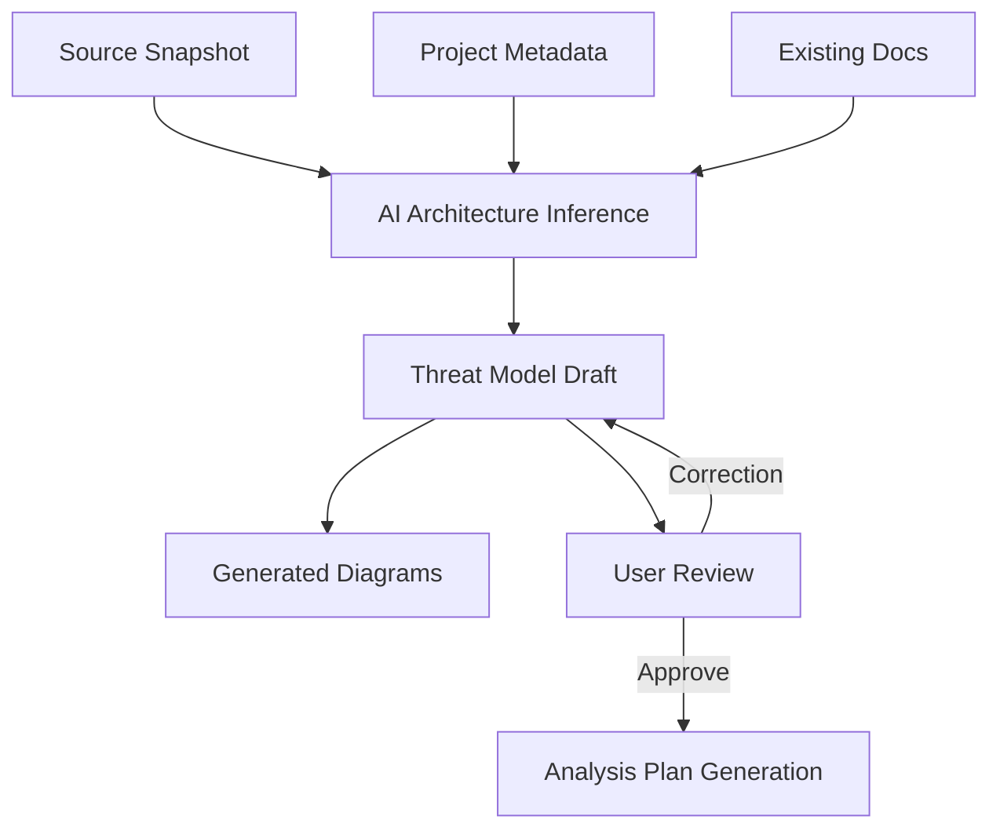

Design choice:

The threat model must be user-approved before deep analysis. AI can infer a lot, but build environments, deployment exposure, service boundaries, and authentication assumptions are often wrong without human correction.

## 7. Analysis Planning

After threat model approval, the system generates an analysis plan.

The plan answers:

- Which components should be analyzed?
- Which trust boundaries matter?
- Which entry points are security-sensitive?
- Which tools should run?
- Which fuzz targets are likely valuable?
- Which skills should be applied?
- What is out of scope?
- What commands and resource limits should be used?

Example:

```text
If a public file upload endpoint reaches an image parser:
  run route analysis
  run parser-focused static checks
  build fuzz harness for parser entry point
  run sanitizer-enabled fuzzing
  prioritize memory corruption, path traversal, and decompression risks
```

## 8. Analysis Execution

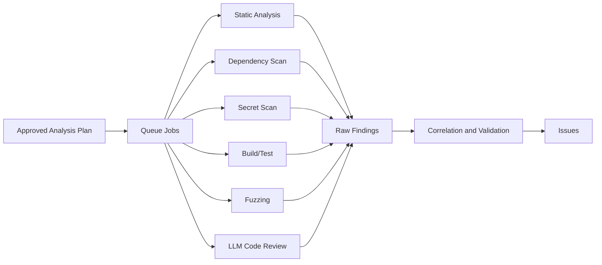

Static analysis can identify likely bug patterns quickly. Fuzzing can provide runtime evidence. LLM reasoning can connect code paths, architecture context, and exploitability. The correlation stage combines these signals instead of treating each finding independently.

## 9. Finding Correlation

Raw outputs are noisy, duplicated, and often lack context. The correlation job turns tool results into real vulnerability candidates.

Inputs:

- Threat model.
- Analysis plan.
- Static findings.
- Dependency findings.
- Fuzzer crashes.
- Build/test logs.
- LLM review notes.
- Reachability evidence.
- Source snippets.
- Runtime assumptions.

Correlation decisions:

- Is the finding reachable?
- Does it cross a trust boundary?
- Is it exploitable?
- Is it a duplicate?
- Is it a false positive?
- What asset is impacted?
- What is the severity?
- What evidence supports it?
- Can the issue be reproduced?

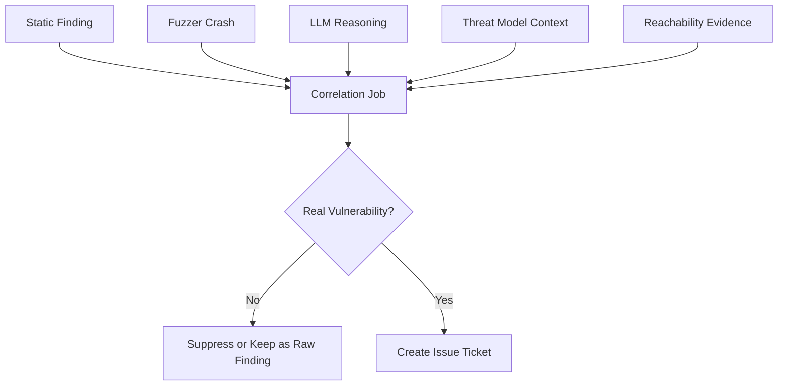

## 10. Issue Ticket Model

An issue is the product-facing vulnerability object. It should contain enough information for an engineer to understand, reproduce, prioritize, and fix the vulnerability.

Issue fields:

- Title.
- Severity.
- CWE.
- Status.
- Affected component.
- Affected files/functions.
- Entry point.
- Trust boundary crossed.
- Impacted asset.
- Exploitability.
- Confidence.
- Reproducibility.
- Evidence summary.
- Reproduction steps.
- Exploit scenario.
- Suggested fix.
- Validation status.
- Linked artifacts.
- Raw finding references.
- Flow diagram.
- Comments and chat references.

Issue lifecycle:

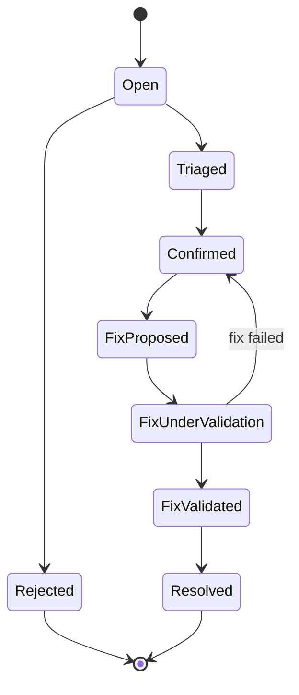

Example issue flow:

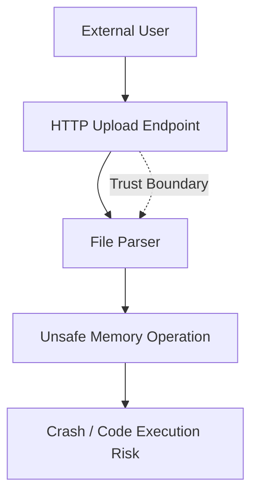

## 11. Fix Validation

Fix validation is a separate workflow. It should not be mixed with initial vulnerability detection.

Inputs:

- Issue ticket.
- Proposed patch.
- Original reproducer or evidence.
- Source snapshot.
- Build/test profile.
- Relevant skills.

Validation steps:

- Understand the root cause.
- Apply patch in disposable workspace.
- Re-run the original reproducer.
- Re-run focused tests.
- Re-run relevant static checks.
- Re-run fuzz target when applicable.
- Check for obvious regression or bypass.
- Produce validation report.

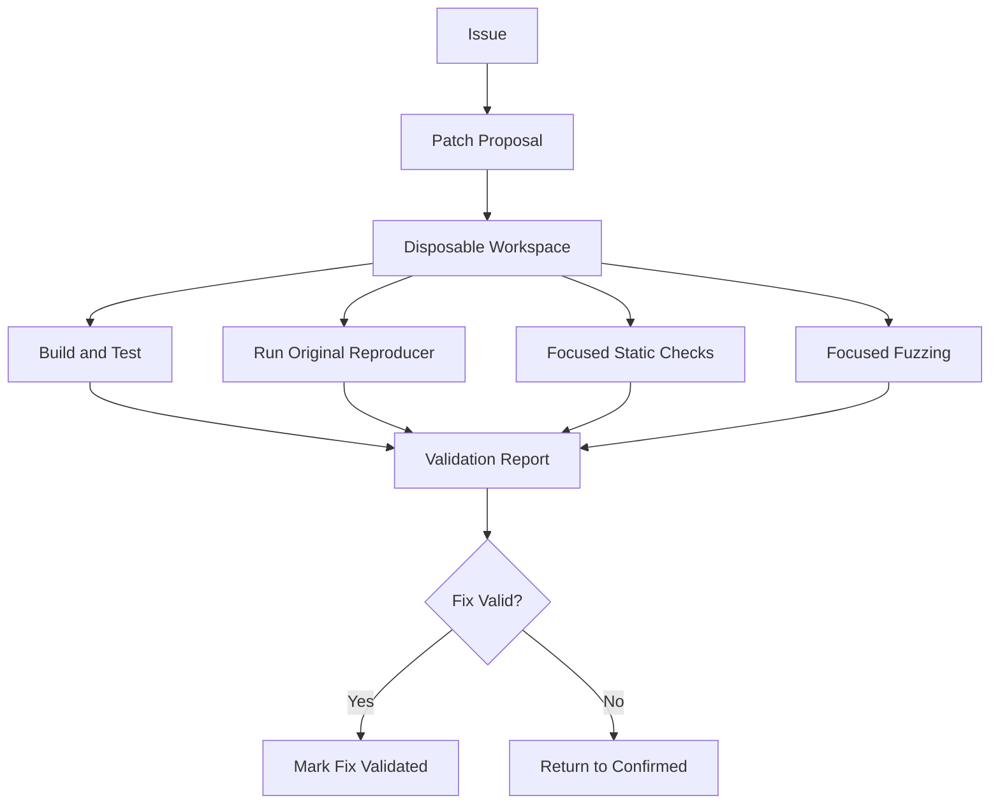

Validation output:

- Fix addresses root cause: yes/no/partial.
- Original exploit still works: yes/no.
- Tests pass: yes/no.
- Regression tests added: yes/no.
- New risks introduced: yes/no/unknown.
- Confidence level.
- Evidence artifacts.
- Recommended next action.

## 12. Integrated AI Chat

The integrated AI chat is a project assistant and operator console.

It should be available from:

- Project setup.
- Threat model review.
- Analysis plan.
- Analysis run details.
- Issue detail.
- Fix validation.

The chat should have controlled tools, not unrestricted host access.

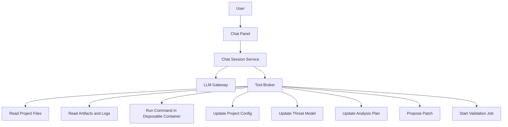

Chat capabilities:

- Explain AI-generated threat models.
- Accept and structure user corrections.
- Debug failed builds.
- Inspect logs and artifacts.
- Update build commands.
- Update runtime assumptions.
- Regenerate diagrams.
- Adjust analysis plans.
- Explain findings.
- Mark likely duplicates or false positives.
- Propose fixes.
- Start validation tasks.

Important rule:

Chat memory alone is not enough. Corrections must be written into structured platform state.

Example:

```text
User correction:
  "This service is not public. It only receives traffic from the internal gateway."

Structured updates:
  threat_model.components
  threat_model.trust_boundaries
  threat_model.entry_points
  analysis_plan.assumptions
  project.runtime_metadata
```

## 13. Tool Broker and Permissions

The tool broker controls what the chat and AI jobs can do.

Tool categories:

```text
Read-only:
  list_project_files
  read_project_file
  read_artifact
  read_build_log

Diagnostic:
  run_command_in_analysis_container
  inspect_dependency_tree
  run_build_check
  run_test_check

State-changing:
  update_project_config
  update_threat_model
  update_analysis_plan
  create_issue_comment
  propose_patch
  start_validation_job
```

Recommended permission model:

- Read-only project-scoped tools can run automatically.
- Diagnostic commands run only in disposable containers.
- Project config changes require explicit user approval.
- Threat model and analysis plan changes create revisions.
- Patch application requires explicit user approval.
- Retrying analysis requires explicit user approval.
- Deleting artifacts should be disabled or admin-only in the first version.

## 14. Data Model Overview

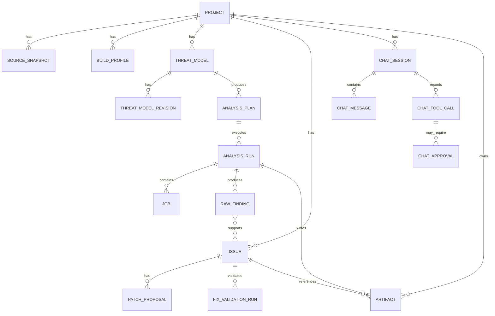

Suggested core tables:

- `projects`
- `source_configs`
- `source_snapshots`
- `build_profiles`
- `threat_models`
- `threat_model_revisions`
- `analysis_plans`
- `analysis_runs`
- `jobs`
- `raw_findings`
- `issues`
- `issue_evidence`
- `patch_proposals`
- `fix_validation_runs`
- `artifacts`
- `skills`
- `skill_runs`
- `llm_providers`
- `llm_requests`
- `chat_sessions`
- `chat_messages`
- `chat_tool_calls`
- `chat_approvals`

## 15. Docker Compose Architecture

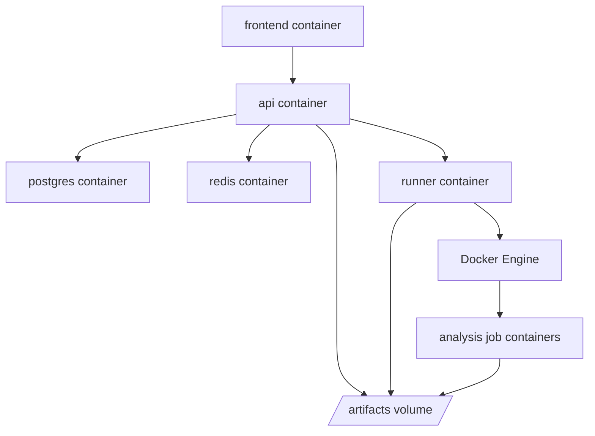

Suggested services:

```text
frontend
api
worker
runner
postgres
redis
```

Suggested volumes:

```text
postgres_data
redis_data
artifacts
```

The analysis job containers may be launched dynamically by the runner instead of being permanent Compose services.

## 16. Security Design Choices

Analysis systems execute untrusted code. The platform should be careful from the first version.

Recommended controls:

- Run analysis containers as non-root.
- Use read-only mounts where possible.
- Mount only the source snapshot and run artifact directory.
- Apply CPU, memory, process, and timeout limits.
- Disable network by default for analysis jobs.
- Allow network only for explicitly approved dependency installation steps.
- Avoid mounting the Docker socket into the API container.
- Keep Docker-launching permission inside the runner only.
- Store secrets encrypted or use environment-level secret injection.
- Redact secrets before sending context to external LLM providers.
- Keep raw prompts and responses auditable, with sensitive data controls.

## 17. Design Choices Summary

Threat model before scanning:

This improves precision because the system knows assets, trust boundaries, entry points, and deployment assumptions before deciding what to analyze.

User approval gate:

The user can correct wrong AI assumptions before expensive or misleading analysis starts.

Separate analysis containers:

This keeps tools isolated, reproducible, and easier to scale later.

File-based storage first:

Local file storage is simpler for the first version. The `ArtifactStore` abstraction preserves a future path to MinIO/S3.

LLM gateway:

Provider switching should be a platform capability, not scattered conditionals across workers.

Skills:

Skills give repeatable, versioned analysis behavior. They make it possible to explain why a job ran the way it did.

Correlation job:

The portal should show real vulnerability issues, not a raw scanner dump.

Separate fix validation:

Fix validation has a different goal from detection and should have its own workflow, evidence, and status.

Integrated AI chat:

The chat closes the loop when AI assumptions are wrong. It lets users correct context and debug failed stages without leaving the portal.
