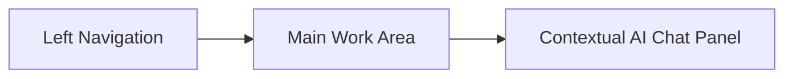

# Kavach360 UI Layout

## 1. Product Shape

Kavach360 should feel like an engineering operations portal, not a marketing site. The first screen after launch should be the actual workspace: projects, analysis status, issues, and action queues.

The UI should optimize for:

- Reviewing AI-generated assumptions.
- Correcting project context quickly.
- Monitoring long-running jobs.
- Separating raw tool output from real issues.
- Understanding exploitability and impact.
- Validating fixes with evidence.
- Using AI chat without losing structured workflow state.

## 2. Information Architecture

```text
Workspace
  Projects
    Project Overview
    Source & Build
    Threat Model
    Analysis Plan
    Runs
    Issues
    Fix Validation
    Artifacts
    Settings
  Global Queue
  Model Providers
  Skills
```

Suggested primary navigation:

```text
Projects
Queue
Issues
Skills
Models
Settings
```

Inside a project:

```text
Overview
Source
Threat Model
Analysis
Issues
Validation
Artifacts
Settings
```

## 3. Global Application Shell



Layout:

```text
+-------------------------------------------------------------------+
| Top Bar: workspace, search, active model, queue status, user menu  |
+-------------+--------------------------------------+--------------+
|             |                                      |              |
| Left Nav    | Main Content                         | AI Chat      |
|             |                                      | Panel        |
| Projects    | Project/run/issue specific screens   | Contextual   |
| Queue       |                                      | assistant    |
| Issues      |                                      |              |
| Skills      |                                      |              |
| Models      |                                      |              |
| Settings    |                                      |              |
|             |                                      |              |
+-------------+--------------------------------------+--------------+
```

Design notes:

- The left navigation should be compact and stable.
- The main work area should be dense and scan-friendly.
- The chat panel should be collapsible.
- The chat panel should be aware of the current project, run, threat model, issue, or validation task.
- Avoid large hero sections. This is a working tool.

## 4. Dashboard

Purpose:

Give the user a quick view of project health, active runs, pending reviews, and open issues.

Recommended content:

- Projects needing threat model review.
- Running analysis jobs.
- Failed jobs requiring attention.
- New confirmed issues.
- Fix validations awaiting review.
- Recent activity.

Wireframe:

```text
+-------------------------------------------------------------------+
| Dashboard                                            [New Project] |
+-------------------------------------------------------------------+
| Review Required          | Active Runs             | Open Issues   |
| 3 threat models          | 5 jobs running           | 12 critical   |
| 2 failed builds          | 1 fuzzing campaign       | 27 high       |
+--------------------------+-------------------------+---------------+
| Projects Requiring Action                                      |
| Project        Stage              Status            Action      |
| api-service     Threat Model       Awaiting review   Review     |
| parser-lib      Build              Failed            Debug      |
| gateway         Validation         Fix failed         Inspect    |
+-------------------------------------------------------------------+
| Recent Activity                                                  |
+-------------------------------------------------------------------+
```

## 5. Project Creation

Project creation should be a guided workflow.

Steps:

```text
1. Basics
2. Source
3. Build & Test
4. Runtime Context
5. Model & Skill Settings
6. Review
```

Fields:

- Project name.
- Description.
- Source type: Git URL, uploaded archive, mounted path.
- Default branch or commit.
- Language/framework hints.
- Build command.
- Test command.
- Working directory.
- Runtime type: web app, API, CLI, daemon, library, service.
- Deployment exposure: public, internal, local-only.
- Sensitive assets.
- External services.
- Authentication assumptions.
- Preferred LLM profile.
- Enabled skill packs.

Wireframe:

```text
+-------------------------------------------------------------------+
| New Project                                                       |
+-------------------------------------------------------------------+
| Stepper: Basics > Source > Build > Runtime > AI Settings > Review |
+-------------------------------------------------------------------+
| Source                                                            |
| [ Git URL                                                   ]      |
| [ Branch / commit                                          ]      |
| [ ] Repository requires credentials                               |
|                                                                   |
| Detected after source ingest:                                     |
|   Language: Java, JavaScript                                      |
|   Build files: pom.xml, package.json                              |
|                                                                   |
|                                             [Back] [Continue]      |
+-------------------------------------------------------------------+
```

## 6. Project Overview

Purpose:

Show where the project is in the lifecycle and what needs attention.

Wireframe:

```text
+-------------------------------------------------------------------+
| api-service                                      [Start Analysis]  |
| Public API, Java, PostgreSQL, last analyzed 2h ago                 |
+-------------------------------------------------------------------+
| Lifecycle                                                         |
| Source Ingested -> Threat Model Approved -> Analysis Running       |
+-------------------------------------------------------------------+
| Key Risks                 | Latest Run              | Issues       |
| Auth boundary             | Static complete          | 2 Critical   |
| File upload parser        | Fuzzing running          | 5 High       |
| Admin API                 | Correlation queued       | 8 Medium     |
+-------------------------------------------------------------------+
| Attention Required                                                |
| Build profile may be incomplete                    [Open Chat]     |
| Threat model has 2 unresolved assumptions          [Review]        |
+-------------------------------------------------------------------+
```

## 7. Source & Build Screen

Purpose:

Let users configure how the project is fetched, built, and tested.

Sections:

- Source snapshots.
- Build profile.
- Test profile.
- Dependency install profile.
- Container environment.
- Recent build logs.
- AI-suggested corrections.

Wireframe:

```text
+-------------------------------------------------------------------+
| Source & Build                                      [Run Check]    |
+-------------------------------------------------------------------+
| Source Snapshot                                                   |
| Commit: a1b2c3d     Branch: main      Created: 10:42              |
+-------------------------------------------------------------------+
| Build Profile                                                     |
| Working directory   [ services/api                         ]       |
| Build command       [ ./gradlew build                      ]       |
| Test command        [ ./gradlew test                       ]       |
| Java version        [ 21                                  v]       |
| Network for deps    [Requires approval]                           |
+-------------------------------------------------------------------+
| Latest Build Check                                                |
| Status: Failed                                                    |
| Error: missing JDK 21 image                                       |
|                                                [Ask AI to Debug]   |
+-------------------------------------------------------------------+
```

## 8. Threat Model Review

Purpose:

Give users a clear, editable AI-generated threat model before analysis begins.

The user should be able to:

- Review components.
- Review actors.
- Review assets.
- Review trust boundaries.
- Review data flows.
- Correct wrong assumptions.
- Regenerate diagrams.
- Approve the threat model.

Layout:

```text
+-------------------------------------------------------------------+
| Threat Model                                      [Approve Model]  |
+-------------------------------------------------------------------+
| Status: Drafted by AI     Revision: 3     Confidence: Medium       |
+-------------------------------------------------------------------+
| Diagram                                                           |
| +---------------------------------------------------------------+ |
| | Architecture / trust boundary diagram                         | |
| +---------------------------------------------------------------+ |
+-------------------------------------------------------------------+
| Tabs: Overview | Components | Data Flows | Trust Boundaries | Risks |
+-------------------------------------------------------------------+
| Assumptions Needing Review                                        |
| 1. Service is public-facing                         [Correct]      |
| 2. File upload accepts untrusted input               [Correct]      |
+-------------------------------------------------------------------+
```

Threat model detail sections:

- System summary.
- Components.
- Entry points.
- Actors.
- Sensitive assets.
- Trust boundaries.
- Data flows.
- External dependencies.
- Security assumptions.
- Open questions.
- Recommended analysis focus.

Correction interaction:

```text
User: This service is internal-only behind the API gateway.

AI action:
  updates deployment exposure
  updates trust boundary diagram
  updates analysis assumptions
  creates threat model revision
```

## 9. Analysis Plan Screen

Purpose:

Show what the system plans to run and why.

This screen should be generated only after threat model approval.

Wireframe:

```text
+-------------------------------------------------------------------+
| Analysis Plan                                      [Run Analysis]  |
+-------------------------------------------------------------------+
| Generated from Threat Model Revision 3                            |
+-------------------------------------------------------------------+
| Planned Jobs                                                      |
| Static analysis       Semgrep security rules       High priority   |
| Dependency scan       OSV / package audit          Medium          |
| Build/test            ./gradlew test               Required        |
| Fuzzing               file parser target           High priority   |
| LLM review            auth and upload flows        High priority   |
+-------------------------------------------------------------------+
| Out of Scope                                                       |
| Admin CLI is not deployed in production                            |
+-------------------------------------------------------------------+
| [Edit with AI Chat]                              [Approve & Run]   |
+-------------------------------------------------------------------+
```

Each planned job should show:

- Reason selected.
- Inputs.
- Expected outputs.
- Timeout.
- Resource limits.
- Required container image.
- Skill version.
- Network requirement.

## 10. Run Detail Screen

Purpose:

Monitor long-running analysis and inspect outputs.

Wireframe:

```text
+-------------------------------------------------------------------+
| Analysis Run #42                                  Running          |
+-------------------------------------------------------------------+
| Timeline                                                          |
| Source snapshot     Complete                                      |
| Static analysis     Complete                                      |
| Dependency scan     Complete                                      |
| Build/test          Failed                                        |
| Fuzzing             Waiting                                       |
| Correlation         Blocked                                       |
+-------------------------------------------------------------------+
| Job Details                                                       |
| Build/test failed: command exited 127                              |
| [View Logs] [Ask AI to Debug] [Retry Job]                          |
+-------------------------------------------------------------------+
| Artifacts                                                         |
| build.log       semgrep.json       dependency-report.json          |
+-------------------------------------------------------------------+
```

Job states:

```text
Queued
Running
Succeeded
Failed
Blocked
Cancelled
Timed Out
```

## 11. Issues List

Purpose:

Show correlated, actionable vulnerabilities instead of raw scanner output.

Columns:

- Severity.
- Title.
- Component.
- CWE.
- Exploitability.
- Confidence.
- Validation status.
- Source: static/fuzzing/LLM/combined.
- Status.
- Last updated.

Wireframe:

```text
+-------------------------------------------------------------------+
| Issues                                             [Filter] [Sort] |
+-------------------------------------------------------------------+
| Sev      Title                         Exploit  Conf   Status      |
| Critical Path traversal in upload API   High     High   Confirmed  |
| High     Auth bypass in admin route      Medium   Med    Open       |
| Medium   Unsafe dependency version       Low      High   Triaged    |
+-------------------------------------------------------------------+
| Left filters: severity, status, CWE, component, run, confidence     |
+-------------------------------------------------------------------+
```

Recommended filters:

- Severity.
- Status.
- CWE.
- Component.
- Trust boundary.
- Exploitability.
- Confidence.
- Validation state.
- Analysis run.
- Skill.

## 12. Issue Detail

Purpose:

Give all information needed to understand and fix a vulnerability.

Wireframe:

```text
+-------------------------------------------------------------------+
| Critical: Path traversal in upload API             [Validate Fix]  |
| Status: Confirmed   CWE-22   Confidence: High                      |
+-------------------------------------------------------------------+
| Summary                                                           |
| Untrusted filename input reaches filesystem write without path      |
| normalization or directory containment checks.                     |
+-------------------------------------------------------------------+
| Exploit Flow Diagram                                              |
| +---------------------------------------------------------------+ |
| | External user -> Upload endpoint -> File service -> Disk write | |
| +---------------------------------------------------------------+ |
+-------------------------------------------------------------------+
| Tabs: Evidence | Reproduction | Exploitability | Suggested Fix | Raw |
+-------------------------------------------------------------------+
| Evidence                                                          |
| Entry point: POST /upload                                         |
| Sink: FileService.write                                           |
| Trust boundary: Internet -> Application                           |
| Artifacts: semgrep.json, trace.md, reproducer.sh                   |
+-------------------------------------------------------------------+
```

Issue detail sections:

- Summary.
- Impact.
- Exploit flow diagram.
- Affected files/functions.
- Trust boundary.
- Entry point.
- Root cause.
- Reproduction steps.
- Exploit scenario.
- Suggested fix.
- Patch proposal.
- Validation history.
- Evidence artifacts.
- Raw findings.
- Comments.
- Related chat sessions.

Issue states:

```text
Open
Triaged
Confirmed
Fix Proposed
Fix Under Validation
Fix Validated
Resolved
Rejected / False Positive
```

## 13. Fix Validation Screen

Purpose:

Let users test whether a proposed or applied fix actually addresses the real vulnerability.

Inputs:

- Issue.
- Patch source: uploaded diff, generated patch, branch/commit, manual instructions.
- Validation profile.
- Original reproducer.
- Focused tests.
- Fuzzing option.

Wireframe:

```text
+-------------------------------------------------------------------+
| Fix Validation: Path traversal in upload API                       |
+-------------------------------------------------------------------+
| Patch Source                                                      |
| ( ) AI-generated patch                                            |
| ( ) Uploaded diff                                                 |
| ( ) Git branch / commit                                           |
+-------------------------------------------------------------------+
| Validation Checks                                                 |
| [x] Build                                                         |
| [x] Unit tests                                                    |
| [x] Original reproducer                                           |
| [x] Focused static analysis                                       |
| [ ] Focused fuzzing                                               |
+-------------------------------------------------------------------+
| Result                                                            |
| Fix addresses root cause: Yes                                     |
| Original exploit still works: No                                  |
| Confidence: High                                                  |
+-------------------------------------------------------------------+
```

Validation result states:

```text
Not Started
Running
Passed
Failed
Partial
Inconclusive
```

## 14. Integrated AI Chat UI

The AI chat should be contextual and available throughout the product.

Common locations:

- Right-side docked panel.
- Full-screen chat mode for complex debugging.
- Inline "Ask AI" action on assumptions, jobs, issues, and validation results.

Chat panel wireframe:

```text
+----------------------------------+
| AI Chat       Context: Issue #14  |
+----------------------------------+
| AI: I found this issue through... |
|                                  |
| User: The upload route is only    |
| reachable by admins.             |
|                                  |
| AI: I can update the threat model |
| and reduce external exposure.     |
+----------------------------------+
| Pending Action                   |
| Update issue exploitability from |
| High to Medium                   |
| [Review Diff] [Approve]          |
+----------------------------------+
| [ Ask about this issue...      ] |
+----------------------------------+
```

Chat context modes:

- Project chat.
- Threat model chat.
- Analysis run chat.
- Job debugging chat.
- Issue chat.
- Fix validation chat.

Chat actions:

- Read project files.
- Read artifacts.
- Explain a model decision.
- Update build profile.
- Update threat model.
- Update analysis plan.
- Retry a job.
- Mark duplicate.
- Propose patch.
- Start validation.

Important UI rule:

Any state-changing AI action should show a proposed structured change before applying it.

Example approval card:

```text
Proposed Change

Object:
  Threat Model Revision 3

Change:
  deployment_exposure: public -> internal
  entry_point.POST_/upload.exposure: internet -> internal-gateway

Impact:
  Regenerate analysis plan
  Re-score 2 existing issues

[Reject] [Approve]
```

## 15. Model Provider Settings

Purpose:

Allow users to configure and switch LLM providers.

Fields:

- Provider type.
- API base URL.
- API key reference.
- Default model.
- Model aliases.
- Timeout.
- Token budget.
- Data handling mode.
- Enabled for stages.

Wireframe:

```text
+-------------------------------------------------------------------+
| Model Providers                                      [Add Provider]|
+-------------------------------------------------------------------+
| Provider      Type        Default Model       Status               |
| OpenAI        Cloud       reasoning-large     Connected            |
| Claude        Cloud       reasoning-large     Missing key          |
| Ollama        Local       local-private       Connected            |
+-------------------------------------------------------------------+
| Model Aliases                                                     |
| reasoning-large -> OpenAI / selected model                        |
| fast-json        -> OpenAI-compatible small model                  |
| local-private    -> Ollama local model                             |
+-------------------------------------------------------------------+
```

## 16. Skills Screen

Purpose:

Let users inspect available reproducible workflows.

Skill list columns:

- Name.
- Version.
- Purpose.
- Container image.
- Supported languages.
- Last used.
- Enabled.

Skill detail:

- Instructions.
- Input schema.
- Output schema.
- Required tools.
- Prompt versions.
- Test status.
- Execution history.

Wireframe:

```text
+-------------------------------------------------------------------+
| Skills                                               [Import Skill]|
+-------------------------------------------------------------------+
| threat-model-web-api      v1.0.0      Enabled                      |
| static-analysis-java      v1.0.0      Enabled                      |
| patch-validation          v1.0.0      Enabled                      |
+-------------------------------------------------------------------+
| Skill Detail                                                      |
| Purpose: Generate web API threat model from source and metadata     |
| Inputs: source_snapshot, project_metadata                          |
| Outputs: components, flows, boundaries, diagrams                   |
+-------------------------------------------------------------------+
```

## 17. Artifacts Screen

Purpose:

Allow users to inspect generated files without exposing raw filesystem paths as the primary interface.

Columns:

- Name.
- Type.
- Source job.
- Related issue.
- Size.
- Created at.
- Retention status.

Artifact types:

- Source snapshot.
- Build log.
- Static report.
- Dependency report.
- Fuzzer crash.
- Coverage file.
- Diagram.
- Patch.
- Validation report.

## 18. Empty, Loading, And Error States

Important states:

- No projects yet.
- Source ingest running.
- Threat model generation failed.
- Threat model awaiting review.
- Analysis blocked by unapproved threat model.
- Build failed.
- Fuzzing timed out.
- Correlation produced no confirmed issues.
- Validation inconclusive.
- LLM provider unavailable.

Example blocked state:

```text
Analysis is blocked

The threat model has not been approved yet.

Actions:
  Review threat model
  Ask AI about assumptions
```

## 19. Notification And Review Queues

The product should surface human review points clearly.

Review queue items:

- Threat model requires approval.
- AI proposed project config change.
- Build failed and needs correction.
- Analysis plan requires approval.
- Issue needs triage.
- Patch proposal requires approval.
- Fix validation failed.

## 20. UX Design Choices

Contextual chat:

Users should not have to explain what they are looking at. The chat should know whether the user is on a threat model, run, issue, or validation page.

Structured approvals:

AI corrections should become reviewable data changes. This prevents important project facts from being trapped in chat history.

Diagram-first threat model:

Architecture and trust boundaries are easier to validate visually than as plain text.

Issues over alerts:

The main issues list should show correlated vulnerabilities. Raw scanner findings should remain available, but not as the primary workflow.

Validation as its own section:

Fix verification is important enough to deserve a separate workflow, history, and evidence model.

Compact operational layout:

Security engineers will use this repeatedly. The UI should favor tables, timelines, tabs, filters, and dense evidence panels over decorative layouts.
